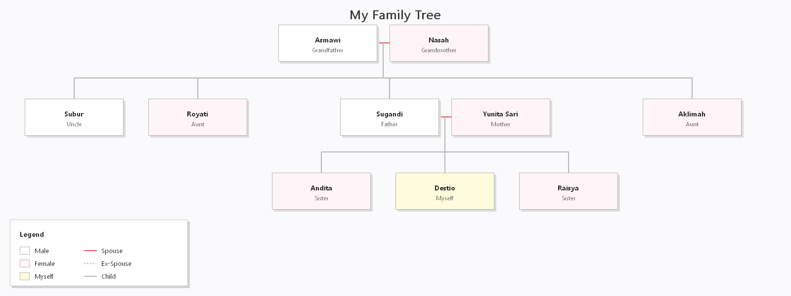

# Family Tree Project (Silsilah Keluarga)

**Mata Kuliah:** Praktikum Algoritma dan Pemrograman Terstruktur C  
**Semester:** Gasal 2025-2026  
**Universitas Paramadina**

## Author
**Nama:** Destio Hardiansyah  
**NIM:** 125103087  
**Prodi:** Teknik Informatika

---

## Deskripsi Project
Program ini adalah aplikasi desktop berbasis **C++** dan **Win32 API** yang dirancang untuk memvisualisasikan silsilah keluarga (Family Tree) secara interaktif dan menarik. 

Data keluarga dibaca secara dinamis dari file eksternal (`Family.csv`), memungkinkan pengguna untuk mengubah struktur keluarga tanpa perlu mengedit kode program (codingan). Program ini menggunakan algoritma layout otomatis untuk menata posisi setiap anggota keluarga, pasangan, dan anak-anaknya agar mudah dibaca.

### Fitur Utama:
1.  **Visualisasi Grafis:** Menggunakan Windows GDI untuk menggambar kotak, garis hubungan, dan teks dengan tampilan yang jelas dan  mudah dipahami.
2.  **Data Dinamis :** Struktur keluarga (Orang tua, Anak, Pasangan) didefinisikan dalam file `Family.csv`.
3.  **Auto-Layout:** Proyek ini sudah memiliki algoritma cerdas yang dapat menempatkan anggota keluarga menyesuaikan generasi, relasi, dan posisinya secara terstruktur.
4.  **Hot-Reloading:** Jika file `Family.csv` diedit saat program berjalan, tampilan akan otomatis diperbarui.
5.  **Export Full Screenshot:** Tombol khusus untuk menyimpan gambar silsilah keluarga secara utuh ke dalam file gambar (`.bmp`). Fitur ini akan merender seluruh anggota keluarga ke dalam satu file gambar.
6.  **Dukungan Relasi Kompleks:** Menangani hubungan Orang Tua dengan Anak, Pasangan (Suami/Istri), dan Mantan Pasangan (Ex-Spouse).


---

## Cara Menggunakan

### 1. Struktur Data (`Family.csv`)
File CSV menggunakan format berikut:
```csv
ID,Name,Role,Gender,FatherID,MotherID,SpouseID
```
- **ID:** Identitas unik (angka).
- **Name:** Nama anggota keluarga.
- **Role:** Hubungan saya dengan anggota keluarga ybs. (kakek, Nenek, Ayah, Ibu, Paman, Sepupu, Saudara, dll.).
- **Gender:** Jenis kelamin (Laki-laki/Perempuan).
- **FatherID:** ID ayah
- **MotherID:** ID ibu
- **SpouseID:** ID pasangan. Gunakan `x` di belakang ID untuk menandakan mantan (contoh: `00121x`).

### 2. Cara Compile & Run
Project ini dapat dikompilasi menggunakan **Code::Blocks**

**Menggunakan Code::Blocks:**
1.  Buka file `FamilyTreeDestio.cbp`.
2.  Klik tombol **Build and Run**.

### 3. Mengambil Screenshot
Klik tombol **Screenshot** di pojok kanan atas aplikasi. 
- Program akan otomatis membuat file gambar baru di folder project dengan format nama: `family_tree_YYYY-MM-DD_HH-MM-SS.bmp`.
- Gambar tersebut akan berisi **seluruh** diagram silsilah keluarga, tidak terpotong layar.

---

## Screenshots Hasil Output

Berikut adalah tampilan hasil program:

### Family Tree (Sederhana)


Untuk lebih jelasnya bisa dilihat gambar berikut di dalam repository:
family_tree_2026-01-21_20-56-55.bmp

### Family Tree (Full Member)


Untuk lebih jelasnya bisa dilihat gambar berikut di dalam repository:
family_tree_2026-01-21_20-09-26.bmp

### Legenda & Detail
- **Kotak Putih:** Laki-laki
- **Kotak Merah Muda:** Perempuan
- **Kotak Kuning:** Diri Sendiri (Myself)
- **Garis Merah:** Pasangan
- **Garis Putus-putus:** Mantan Pasangan
- **Garis Hitam:** Anak

---

## Video Penjelasan
Penjelasan lengkap mengenai kode dan cara kerja program dapat dilihat pada video berikut:

[**🔗 Link Video Youtube**](https://youtu.be/G9i4ih0qr2o)


---

## Struktur Direktori
```
FamilyTreeDestio/
├── Family.csv          # Database silsilah keluarga
├── main.cpp            # Source code utama (C++ Win32)
├── FamilyTreeDestio.cbp # Project file Code::Blocks
└── README.md           # Dokumentasi ini
```

---
**Catatan:** Project ini dibuat untuk memenuhi Tugas UAS Mata Kuliah Praktikum Algoritma dan Pemrograman Terstruktur (C) Universitas Paramadina.